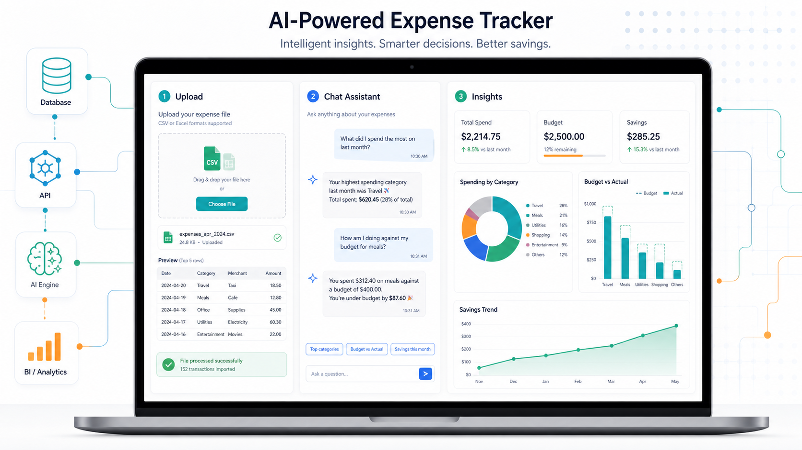
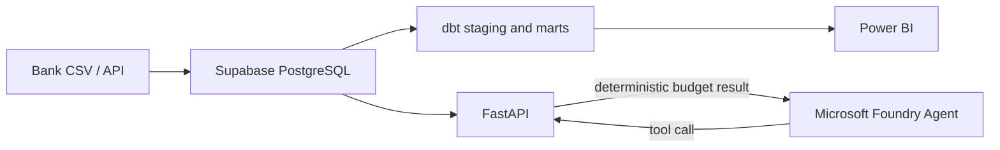

# AI Expense Tracker

An end-to-end personal-finance data platform with a deterministic budgeting API and a Microsoft Foundry agent:

`Supabase PostgreSQL -> dbt -> FastAPI -> Microsoft Foundry Agent -> Power BI`

The project demonstrates dimensional modelling, SCD Type 2 budgets, bank-statement ingestion, analytics marts, API design, and tool-calling AI with explicit financial-safety guardrails.



## Architecture



## Highlights

- Supabase/PostgreSQL schema for transactions, categories, pay periods, savings goals, merchant rules, and SCD Type 2 budgets.
- dbt staging and mart models for monthly summaries, savings rates, pay-period reporting, and budget-versus-actual analysis.
- FastAPI CRUD endpoints plus `POST /advice/can-i-afford` for deterministic category or envelope-budget checks.
- Microsoft Foundry tool-calling agent that explains the API calculation without inventing financial advice.
- CommBank CSV import with rule-based categorisation, duplicate detection, dry-run support, and optional pay-date detection.
- Unit tests for the purchase-affordability rules.

## Quick start

### 1. Create the database

Create a Supabase project, then run [`supabase_schema.sql`](supabase_schema.sql) in the Supabase SQL Editor.

### 2. Run the API

```bash
cd api
python -m venv .venv
# Windows: .venv\Scripts\activate
# macOS/Linux: source .venv/bin/activate
pip install -r requirements.txt
cp .env.example .env
python main.py
```

Set your own Supabase and Foundry values in `api/.env`. The API is available at `http://localhost:8000`, with OpenAPI docs at `/docs`.

Example affordability request:

```bash
curl -X POST http://localhost:8000/advice/can-i-afford \
  -H "Content-Type: application/json" \
  -d '{"item_name":"running shoes","price":150,"category_name":"Shopping"}'
```

### 3. Run dbt

```bash
pip install dbt-postgres
cp dbt_expense_tracker/profiles.example.yml ~/.dbt/profiles.yml
cd dbt_expense_tracker
dbt debug
dbt run
dbt test
```

The example profile reads connection details from environment variables:

```bash
export SUPABASE_DB_HOST="your-pooler-host.supabase.com"
export SUPABASE_DB_USER="your-database-user"
export SUPABASE_DB_PASSWORD="your-database-password"
```

On PowerShell, use `$env:VARIABLE_NAME = "value"` instead of `export`.

### 4. Run the Foundry agent

Keep the API running in another terminal, then:

```bash
pip install -r requirements-agent.txt
az login
python foundry_agent.py
```

The agent calls the affordability endpoint and explains the returned spending, remaining budget, and utilisation. It is explicitly instructed that budget fit does not prove cash availability and is not financial advice.

## Tests

```bash
python -m unittest discover -s api/tests -v
```

## Repository structure

```text
.
|-- api/                         FastAPI service and tests
|-- dbt_expense_tracker/         dbt models and safe profile template
|-- docs/                        Agent governance design and dashboard mockup
|-- foundry_agent.py             Foundry tool-calling agent
|-- import_commbank.py           Generic bank CSV ingestion pipeline
|-- requirements-agent.txt       Agent dependencies
|-- supabase_schema.sql          Canonical PostgreSQL schema
|-- star_schema_*_migration.sql  Incremental schema evolution scripts
`-- seed_test_data.sql           Synthetic development data
```

## Security and privacy

- No bank statements, personal transactions, account identifiers, passwords, or API keys are included.
- `.env`, dbt user profiles, local tool binaries, generated data, and statement exports are ignored.
- Use least-privilege credentials and rotate any credential that has previously been committed elsewhere.

## Roadmap

- Complete the Power BI dashboard and publish screenshots.
- Add AI-assisted transaction mapping with human review.
- Add multi-tenant authentication and row-level security.
- Add scheduled ingestion and dbt orchestration.
