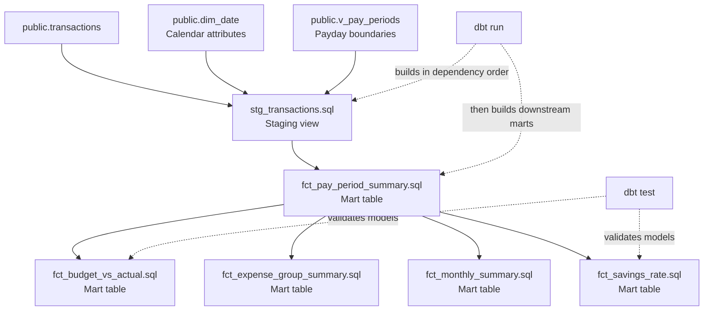

# dbt Expense Tracker Model Flow

dbt builds the models automatically in dependency order when you run `dbt run`; you do not run each SQL file manually. The staging model reads the existing Supabase tables and views, cleans and enriches the transaction data, and is materialized as a view. The mart models use the staging view and are materialized as reporting tables. dbt discovers this order from `{{ ref(...) }}` references, then `dbt test` validates the generated objects and their data.



Typical commands:

```powershell
dbt run
dbt test
```
